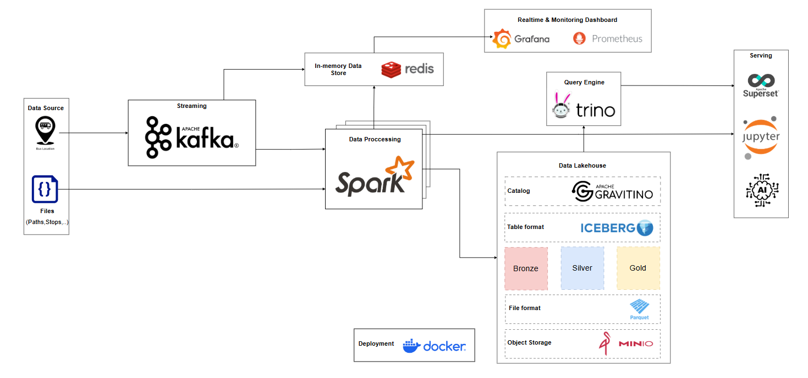
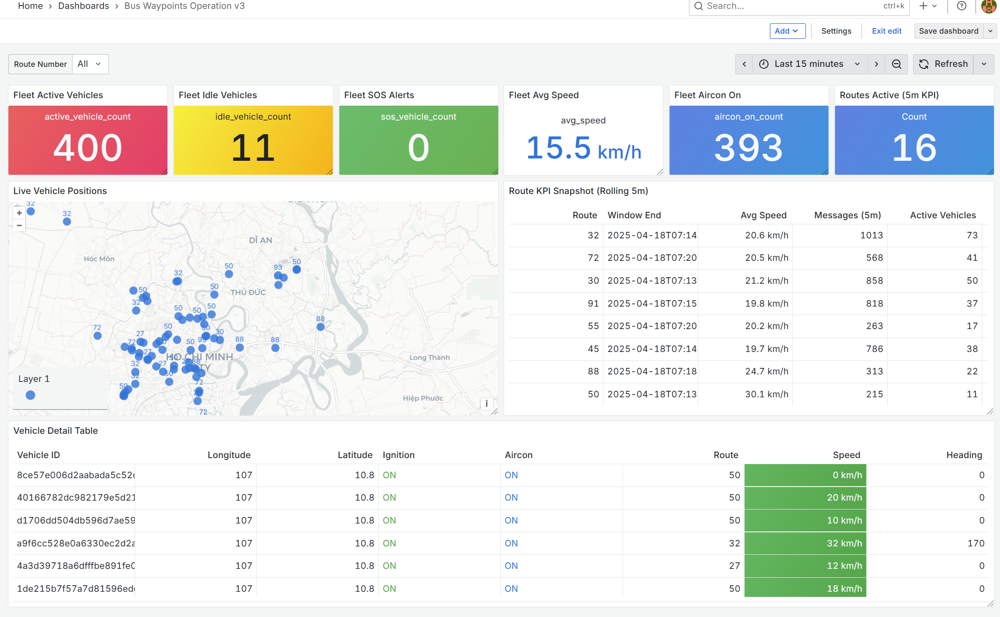

# Modern Data Lakehouse with Apache Iceberg

## 🎓 Project Information
This is a **Multidisciplinary Project (Đồ án đa ngành)** for **Semester 252 (2025-2026)**, developed by **CSE Students** from **Ho Chi Minh City University of Technology (HCMUT)**.

The project is conducted under the guidance of **HPCLab** (High Performance Computing Lab) and the **Advanced Institute of Interdisciplinary Science and Technology (iST)** at **HCMUT**.

The primary goal of this project is to build a robust **data pipeline and platform for Bus GPS Streaming**. It utilizes real-time **Bus GPS data from Ho Chi Minh City**, leveraging **streaming data** technologies and a **modern Lakehouse architecture** (Apache Iceberg) to provide high-performance analytics and monitoring.

---

## 📑 Table of Contents
- [Architecture](#-architecture)
- [Key Features](#-key-features)
- [Technology Stack](#-technology-stack)
- [Documentation & Links](#-documentation--links)
- [Quick Start](#-quick-start)
- [Querying Data](#-querying-data)
- [Project Structure](#-project-structure)

---

## 📐 Architecture




The architecture follows a layered approach:
- **Ingestion Layer**: Apache Kafka for real-time data streaming.
- **Compute Layer**: Apache Spark cluster (1 Master + 2 Workers) for distributed processing.
- **Query Layer**: Trino for fast, interactive SQL analytics.
- **Catalog Layer**: Apache Gravitino as the Iceberg REST catalog service.
- **Table Format**: Apache Iceberg for ACID transactions and time travel.
- **File Format**: Apache Parquet for efficient columnar storage.
- **Storage Layer**: MinIO (S3-compatible) for scalable object storage.
- **Observability**: Grafana and Prometheus for metrics and monitoring.

---

## ✨ Key Features

- **🔄 ACID Transactions**: Full ACID support via Apache Iceberg with snapshot isolation.
- **⚡ Distributed Processing**: Spark cluster with 1 master and 2 worker nodes.
- **🎯 Multi-Engine Access**: Query data using Spark SQL, Trino, or PySpark notebooks.
- **📊 Real-time Ingestion**: Kafka cluster (KRaft mode) for streaming data pipelines.
- **🔍 Unified Catalog**: Gravitino REST catalog for centralized metadata management.
- **📈 Built-in Monitoring**: Prometheus metrics with Grafana dashboards.
- **🐳 Fully Dockerized**: One-command deployment with Docker Compose.
- **🔐 S3-Compatible Storage**: MinIO for cost-effective data lake storage.

---

## 🛠 Technology Stack

| Component | Version | Purpose |
|-----------|---------|---------|
| **Apache Spark** | 3.5.5 | Distributed data processing engine |
| **Apache Iceberg** | 1.10.0 | Open table format for huge analytic datasets |
| **Apache Gravitino** | 1.1.0 | REST catalog service for lakehouse metadata |
| **Apache Kafka** | 3.9.0 | Distributed event streaming platform |
| **Trino** | 471 | Fast distributed SQL query engine |
| **MinIO** | 2025-09-07 | S3-compatible object storage |
| **PostgreSQL** | 16 | Catalog backend database |
| **Grafana** | 12.1.0 | Metrics visualization |
| **Prometheus** | 3.5.1 | Metrics collection and alerting |
| **Python** | 3.12.3 | Runtime for PySpark applications |

---

## 📚 Documentation & Links

### 📄 Detailed Documentation
For deep dives into specific components, please refer to the files in the `docs/` folder:
- [Architecture Deep Dive](./docs/architecture.md)
- [Deployment Guide](./docs/deploy.md)
- [Kalman Filter for Bus GPS](./docs/kalman_filter_bus_gps.md)
- [MinIO & Iceberg Lakehouse Setup](./docs/minio_iceberg_gravitino_lakehouse.md)
- [Redis Serving Layer](./docs/redis_serving_layer.md)

### 📂 Sub-module Readmes
- [Infrastructure Setup](./infrastructure/README.md)
- [Data Pipelines](./pipelines/README.md)
- [Interactive Notebooks](./notebooks/README.md)
- [Data Sources & Samples](./data/README.md)

---

### 📊 Real-time Monitoring Dashboard (Grafana, Redis)


---

## 🚀 Quick Start

### Prerequisites
- Docker Engine 20.10+ with Docker Compose
- At least 8GB RAM available for containers
- Ports available: 8080, 8090, 8888, 3000, 9000, 5432

### 1. Clone and Start

```bash
# Clone the repository
git clone https://github.com/dducsw/mp252.git
cd mp252

# Start all services
docker compose up --detach --build
```

### 2. Initialize Schema
```shell
docker exec -it spark-master spark-sql -f /opt/spark/apps/setup/create_schema.sql
```

### 3. Run a Pipeline
```shell
docker exec -it spark-master python /opt/spark/apps/pipelines/create_example_table.py
```

### 4. Using Notebooks
- Access **JupyterLab** at `http://localhost:8888`.
- Your notebooks are saved in the `notebooks/` directory.

---

## 🔍 Querying Data
You can query tables using either Spark or Trino:

**Spark SQL:**
```shell
docker exec -it spark-master spark-sql
SELECT * FROM catalog_iceberg.schema_iceberg.table_iceberg;
```

**Trino CLI:**
```shell
docker exec -it trino trino --catalog catalog_iceberg --schema schema_iceberg
SELECT * FROM table_iceberg;
```

---

## 📁 Project Structure

```
Project
│
├── 📄 docker-compose.yml              # Main orchestration file for all services
├── 📄 .env                            # Environment variables and version configurations
├── 📄 README.md                       # Main Documentation (You are here)
│
├── 📁 docs/                           # Detailed Technical Documentation
│   ├── architecture.md
│   ├── deploy.md
│   └── ...
│
├── 📁 infrastructure/                 # Service configurations [README.md](./infrastructure/README.md)
│   ├── 📁 common/ | 📁 gravitino/ | 📁 spark/ | 📁 trino/
│   └── 📁 prometheus/ | 📁 grafana/
│
├── 📁 data/                           # Data sources and samples [README.md](./data/README.md)
│
├── 📁 notebooks/                      # Jupyter Notebooks [README.md](./notebooks/README.md)
│
├── 📁 pipelines/                      # Data Pipelines [README.md](./pipelines/README.md)
│
├── 📁 scripts/                        # Utility Scripts
│
└── 📁 setup/                          # Initial Setup Scripts
```

---

**⭐ Star this repository if you find it helpful!**
