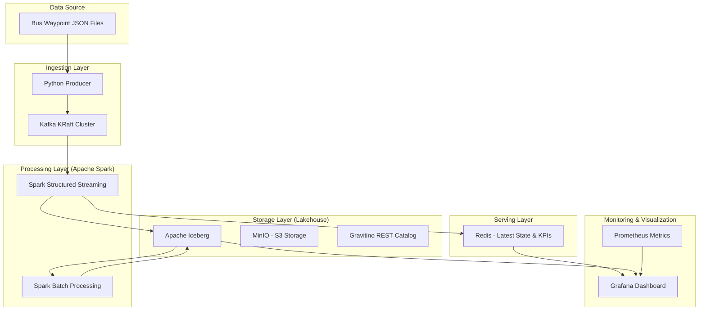

# Project Architecture & Data Pipeline

This document provides a comprehensive overview of the end-to-end architecture and data pipelines for the Bus Waypoint Data Platform.

## 1. High-Level Architecture

The platform follows a **Lambda-like architecture** but optimized as a **Modern Data Lakehouse**. It enables both real-time monitoring and long-term analytical processing.

---

## 2. Pipeline Stages

### 2.1 Data Generation & Ingestion
- **Source**: Raw JSON files containing bus waypoints (vehicle ID, coordinates, speed, status, timestamp).
- **Ingestion**: A robust **Python Producer** reads these files and streams them into **Kafka** (topic: `buswaypoint_json`).
- **Optimization**: The producer uses Snappy/Gzip compression and batching to achieve high throughput (>10k msg/s).

### 2.2 Processing Layer (Medallion Architecture)
We use the Medallion architecture to organize data into different levels of refinement:

1.  **Bronze (Raw)**: 
    - **Process**: Spark Structured Streaming consumes from Kafka.
    - **Storage**: Appends raw events into Iceberg `bus_bronze.bus_way_point`.
    - **Feature**: Schema enforcement and ingestion timestamping (`load_at`).

2.  **Silver (Refined)**:
    - **Process**: Batch jobs perform data cleaning, deduplication (using Window functions), and enrichment.
    - **Operations**: Joins with `route_info` and `vehicle_mapping`. Filtering invalid coordinates or extreme speeds.
    - **Storage**: Iceberg `bus_silver.bus_way_point` partitioned by `date`.

3.  **Gold (Aggregated/Business)**:
    - **Process**: Complex analytical transformations.
    - **Outputs**: 
        - `trip_summary`: Segmented trips with distance, duration, and average speed.
        - `vehicle_daily_stats`: Daily performance KPIs per vehicle.
        - `gold_bus_dashboard`: Flattened data optimized for Grafana.

### 2.3 Storage Layer (Lakehouse)
- **Apache Iceberg**: Provides SQL-like capabilities (ACID transactions, Time Travel, Schema Evolution) on top of object storage.
- **MinIO**: Acts as the high-performance S3-compatible object store.
- **Gravitino**: Manages the metadata and provides a unified Iceberg REST Catalog for both Spark and Trino.

### 2.4 Serving Layer (Real-time)
- **Kafka to Redis Pipeline**: A dedicated consumer syncs Kafka events to Redis.
- **Data Structures**:
    - **Hashes**: Latest state of each vehicle for O(1) lookups.
    - **Streams**: Real-time event tracking.
    - **KPI Hashes**: Pre-calculated route-level metrics (active bus count, avg speed) for instant dashboard updates.

### 2.5 Monitoring & Visualization
- **Prometheus**: Collects system-level metrics (CPU, Memory, Kafka Lag, Spark Throughput).
- **Grafana**: The unified dashboard platform.
    - **Real-time View**: Connects to Redis for live bus tracking.
    - **Analytical View**: Connects to Iceberg (via Spark/Trino) for historical reporting and trend analysis.

---

## 3. Technology Stack

| Layer | Technology |
| :--- | :--- |
| **Messaging** | Apache Kafka (KRaft) |
| **Processing** | Apache Spark (Python/PySpark) |
| **Table Format** | Apache Iceberg |
| **Catalog** | Gravitino REST Catalog |
| **Object Store** | MinIO (S3) |
| **Serving** | Redis |
| **Visualization**| Grafana |
| **Metrics** | Prometheus |
| **Container** | Docker & Docker Compose |
| **Infrastructure**| Google Cloud Platform (Spot VM) |
